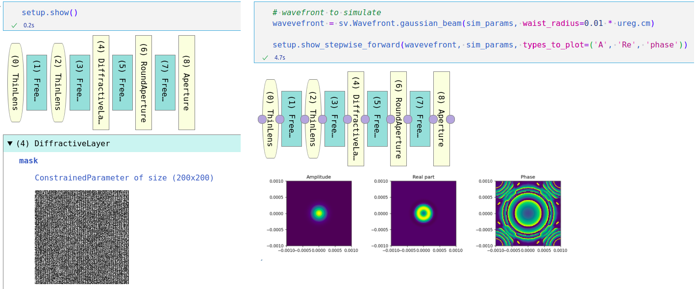

[](https://github.com/CompPhysLab/SVETlANNa/blob/main/README.md)
[](https://github.com/CompPhysLab/SVETlANNa/blob/main/README.ru.md)

# SVETlANNa

SVETlANNa - это Python-библиотека с открытым исходным кодом для моделирования оптических систем в свободном пространстве и нейроморфных систем, таких как дифракционные нейронные сети.
Библиотека построена на фреймворке PyTorch и использует его ключевые возможности: тензорные вычисления и автоматическое дифференцирование.

В основе SVETlANNa лежит фурье-оптика, а среди поддерживаемых оптических элементов — свободное пространство, апертуры, фазовые маски, тонкие линзы и пространственные модуляторы света (SLM).

Название библиотеки объединяет русское слово «свет» и аббревиатуру ANN (artificial neural network, искусственная нейронная сеть).
При этом целиком слово звучит как славянское женское имя Светлана.

## Документация
Документация по SVETlANNa доступна по ссылке: [compphyslab.github.io/SVETlANNa.docs](https://compphyslab.github.io/SVETlANNa.docs/).

Также есть вспомогательный репозиторий на GitHub — [SVETlANNa.docs](https://github.com/CompPhysLab/SVETlANNa.docs), содержащий множество примеров применения в формате Jupyter Notebook.


## Быстрый старт
```python
import torch
import svetlanna as sv
from svetlanna.units import ureg

# задаем вычислительную сетку и длину волны света
sim_params = sv.SimulationParameters(
    x=torch.linspace(-5 * ureg.mm, 5 * ureg.mm, 256),
    y=torch.linspace(-5 * ureg.mm, 5 * ureg.mm, 256),
    wavelength=10 * ureg.um,
)

setup = sv.LinearOpticalSetup([
    sv.elements.RoundAperture(sim_params, radius=2 * ureg.mm),
    sv.elements.FreeSpace(sim_params, distance=10 * ureg.cm, method='ASM'),
])

incident_field = sv.Wavefront.plane_wave(sim_params)
output_field = setup(incident_field)

```

## Возможности

- Решатели для распространения в свободном пространстве, включая метод углового спектра (ASM) и свертку Релея-Зоммерфельда (RSC). Определение методов и их сравнение см. в [этой работе](https://doi.org/10.1364/OL.393111).
- Поддержка решения классических задач оптимизации дифракционных оптических элементов и SLM с использованием алгоритмов Gerchberg-Saxton и Hybrid Input-Output.
- Гибкий API с поддержкой пользовательских элементов.
- Нативное GPU-ускорение для всех вычислений.
- Инструменты визуализации.


## Возможные применения

- Моделирование и оптимизация оптических систем и оптических пучков, распространяющихся в свободном пространстве.
- Расчет параметров фазовых масок, дифракционных оптических элементов (DOE) и SLM как для классических оптических систем, так и для нейроморфных оптических вычислителей.
- Моделирование и оптимизация параметров оптических нейронных сетей и дифракционных оптических нейронных сетей для различных задач.

## Установка

Вы можете установить SVETlANNa из PyPI с помощью pip:
```bash
pip install svetlanna
```
PyTorch рекомендуется установить отдельно, следуя инструкциям на [сайте PyTorch](https://pytorch.org/get-started/locally/), чтобы выбрать конфигурацию, подходящую вашей системе и требованиям (например, поддержка CUDA).

## Примеры

Результат обучения полносвязной оптической нейронной сети для задачи классификации MNIST: изображение цифры «8» проходит через стек из 10 фазовых пластин с настроенными фазовыми масками. Выбранные области детектора соответствуют разным классам цифр. Предсказанный класс определяется областью детектора с максимальной оптической интенсивностью.

Примеры визуализации оптических схем и оптических полей:



Пример пятислойной дифракционной оптической нейронной сети, обученной распознавать цифры из базы MNIST:


# Вклад в проект

Мы всегда рады вашему вкладу!
См. файл `CONTRIBUTING.md`, чтобы узнать, с чего начать.

# Благодарности

Первоначальная работа над репозиторием была поддержана [Фондом содействия инновациям](https://en.fasie.ru/).

# Авторы

- [@aashcher](https://github.com/aashcher)
- [@alexeykokhanovskiy](https://github.com/alexeykokhanovskiy)
- [@Den4S](https://github.com/Den4S)
- [@djiboshin](https://github.com/djiboshin)
- [@Nevermind013](https://github.com/Nevermind013)

# Лицензия

[Mozilla Public License Version 2.0](https://www.mozilla.org/en-US/MPL/2.0/)
